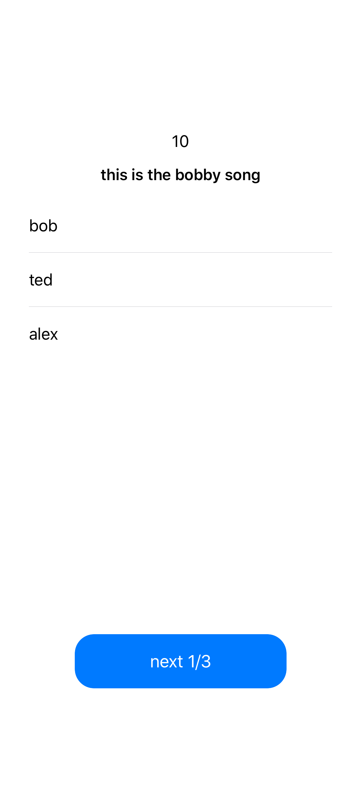
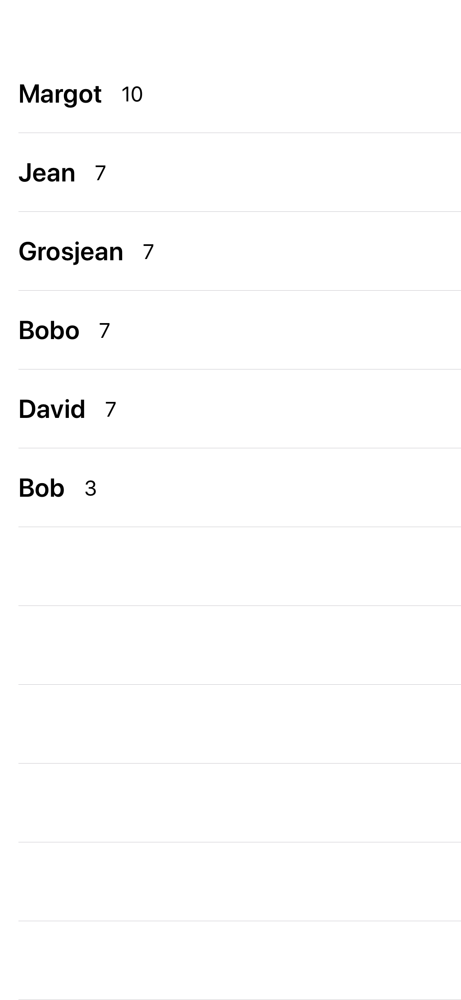
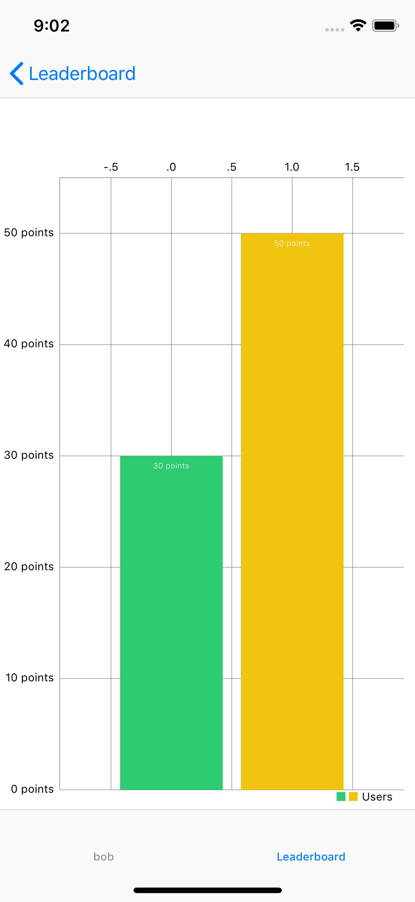

# WhoSings


## Installation

To run the project, clone the repo, and run `pod install` from the root directory first.

```ruby
pod install
```

<table>
  <tr>
	<td></td>
	  <td></td>
   </tr> 
   <tr>
	  <td></td>
	  <td></td>
  </tr>
</table>

## Architecture

__WhoSings__ is based on my personal library [RxComposableArchitecture](https://github.com/jrBordet/RxComposableArchitecture) that is inspired by [The Composable Architecture](https://github.com/pointfreeco/swift-composable-architecture).

[RxComposableArchitecture](https://github.com/jrBordet/RxComposableArchitecture) is a modern _Rx_ library for building applications in a consistent way, with composition and testing.

Usually developers come to __Functional Reactive Programming__ whith just in mind the idea of "reactive", or that everything is a stream of data. Basically it's true but there is a caveat. In fact we should remember that we are working in __functional__ world, which means that we should keep in mind some principle as: __the state immutability__ and __composition__. 

__State immutability__ is a misleading concept. Obviously the state should mutate, in fact our aim is to transform informations. But we must do it in a consistent way. And this is where comes from the idea of the Composable Architecture.


Every feature is defined by some types and values that model your domain:

* __State__: A type that describes the data your feature needs to perform its logic and render its UI.
* __Action__: A type that represents all of the actions that can happen in your feature, such as user actions, http requests, access to a DB and more.
* __Environment__: A type that holds any dependencies the feature needs, such as API clients, analytics clients, and more.
* __Reducer__: A function that describes how to evolve the current state of the app to the next state given an action. The reducer is also responsible for returning any effects that should be run, such as API requests, which can be done by returning an Effect value.
* __Store__: The runtime that actually drives your feature. You send all user actions to the store so that the store can run the reducer and effects, and you can observe state changes in the store so that you can update UI.

The benefits of doing this is that you will instantly unlock testability of your feature, and you will be able to break large, complex features into smaller domains that can be glued together.


Every feature is testable in isolation and the power of the Composable Architecture is the ability to glue together two or more features in order to create a brand new one. 

For example the [gameSessionViewReducer](https://github.com/jrBordet/WhoSings/blob/develop/WhoSings/Features/GameSession/GameViewSession/GameViewSession.swift) is build on the composition of the user login, bootstrap and the game session session. And even the [appReducer](https://github.com/jrBordet/WhoSings/blob/master/WhoSings/AppWhoSings.swift) is build on the composition of the GameView and the Leaderboard.

This lead to an another concept: the __sharing state__. In fact, every time a session is completed, the collection of  sessions is updated and shared between the single Session and the Leaderboard, please refer to [AppState](https://github.com/jrBordet/WhoSings/blob/master/WhoSings/AppWhoSings.swift)


### Engineering for Testability

#### Environment

A type that holds any dependencies the feature needs, for WhoSigns we have client for Musixmatch API. 

##### Scheme
* __WhoSings__: is the live implementation
* __WhoSingsMock__	: a bunch of different scenarioss for manual testing and development

#### UI Application

The folder UI Application contains all the Views and ViewControllers and is isolated from the features domain. 

#### Features domain and Business logic

##### GameView

GameView is the main feature and is composed on three sub-features.

* __Bootstrap__: is responsible to fetch properly the APIs. Download a bunch of TopSongs in Italy and for every track fetch the corresponding lyrics. In addition download a list of artists.
* __Game Session__: once _start_ is called a new game session is created based on the Bootstrap results.
* __Login__: handle a simple login session in local


##### User Session
Simply contains the game user session completed.


## Frameworks


| Pod               | Version         
| -------------     |:-------------:| 
| RxSwift           | 6.0.x         |
| RxCocoa           | 6.0.x         |
| RxDataSources     | 4.0.x         |
| SnapKit | 4.2.0|
| Charts |


### Personal libraries


| Pod                       | Version         
| -------------             |:-------------:| 
| RxComposableArchitecture  | 3.0.0         |


### Pods for testing

| Pod                            | Version         
| -------------                  |:-------------:| 
| RxComposableArchitectureTests  | 3.0.0         |
|SnapshotTesting | 1.7.2|
|RxBlocking|
|RxTest|


## Author

Jean Raphaël Bordet, jr.bordet@gmail.com
